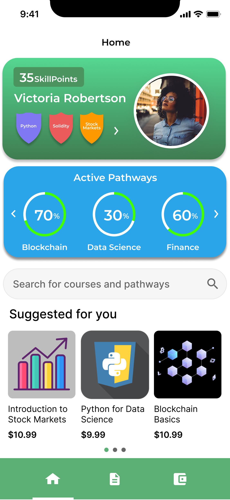
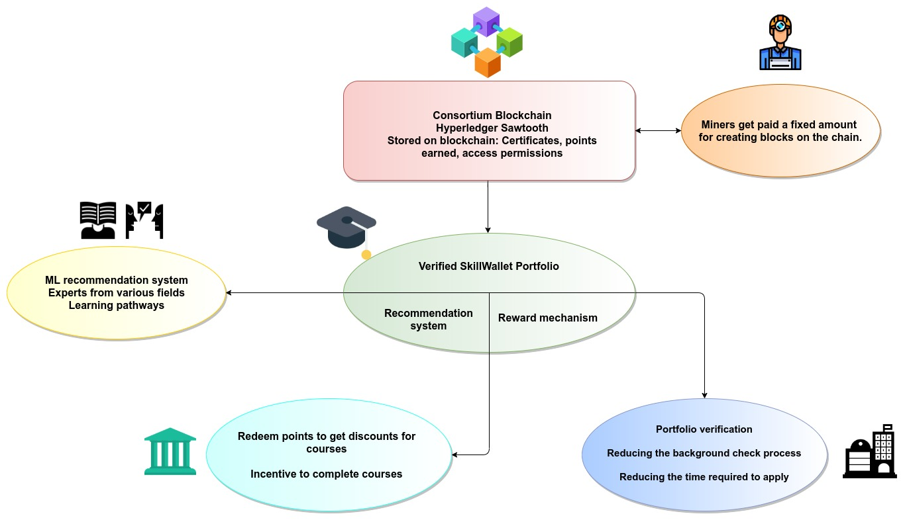
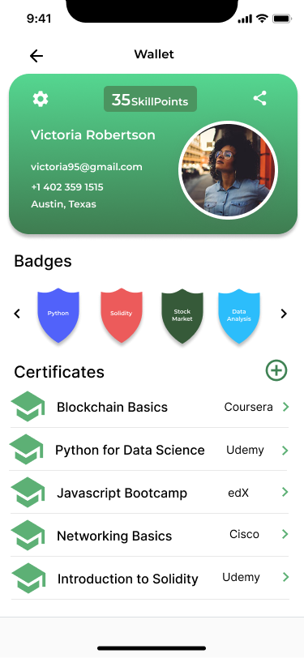
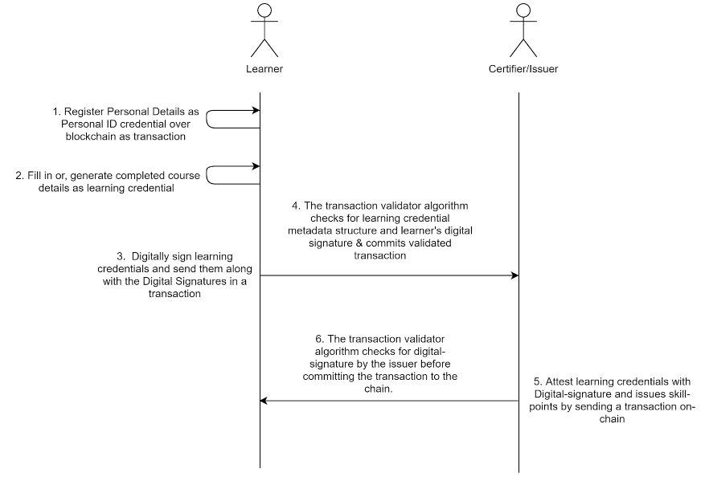
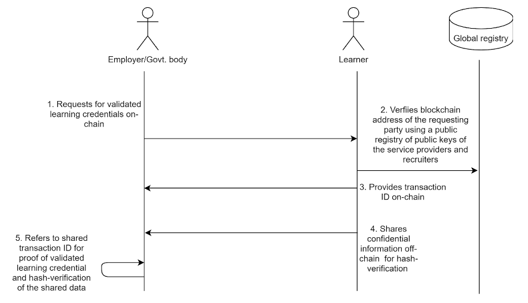

## Introduction
* The [Babylon Project, World Blockchain Hackathon](https://worldblockchainhackathon.com/) - 100% community-funded initiative dedicated to inspiring and democratizing awareness and access to global innovation in blockchain.
* [Presentation slide deck](documents/Skill%20Wallet%20Pitch%20Deck.pdf)
* Here is the pitch : [Video link](https://youtu.be/qCaH_Z8D3TQ)  

## Problem statement
By 2030, a billion jobs are liable to be radically transformed by technology. By 2022, everyone would need an extra 100+ hours of learning. Given inequalities in access to higher education, most people will turn to online learning to fill the skill gap. However, there is a need to streamline the online learning industry. Key problems
  * Too many online courses to choose from
  * Lack of motivation to complete online courses
  * Lack of tamper proof learning credentials
  
## Solution
_SkillWallet - Bridging the skill-gap with a verified learning portfolio._

Smart Skill Portfolio powered by blockchain and AI creating a _reflective_, _actionable_, and _collaborative_ platform for your lifelong learning journey
  * Upskill using personalized learning paths
  * Earn rewards for learning and compete with others
  * Build your online skill portfolio to showcase your blockchain verified skills

## MVP
* [Verified portfolio using Hyperledger Sawtooth (code)](https://github.com/adhithyaarun/skill-wallet/tree/blockchain)
* [Learning pathway recommendation system](https://github.com/adhithyaarun/skill-wallet/tree/recommendation-system/recommender) 
* [User Interface](https://www.figma.com/proto/8NAXn07z9JlQVvIuSUEU2S/SkillWallet-Workflow?node-id=9%3A2285&scaling=scale-down)

# SkillWallet
### _Bridging the skill gap with a verified learning portfolio_

 
 
 

## Introduction
SkillWallet is a  platform aimed at providing users with a _verified learning portfolio_, _personalized learning recommendations_, and _rewards for following through with their learning goals_. This document is intended to provide the _technical details_, _product architecture_, _business model_, and _use-cases_ for different categories of users.

## Background
The current learning paradigm for students and working professionals offers a plethora of resources with a lack of direction for those who aim to advance their careers by augmenting their skill-set. They also raise many concerns in terms of honesty and credibility if certifications and credentials that learners present to recruiters. From the perspective of applicants, the recruiting process and applications become cumbersome due to repetitive processes and similar forms where they must fill in the same details. SkillWallet aims to address many of these issues, and more.

The main problems we identified can be summarized as follows:
- Lack of a sustainable, persistent, tamper-proof storage and management of scattered educational records or skill certificates of a learner in one place for easy access and discovery.
- Existence of a large number of unauthenticated, forged certificates leading to monetary losses for recruiting companies and mistrust in professional fields.
- Manual verification of the educational certifications is time-consuming and costly.
- Unnecessary replication of learners' and applicants' data records at multiple private databases with third parties, that may become obsolete after a specific period and threatens data privacy.
- Lack of data ownership for learners and applicants.
- Security concerns related to the use of prevalent centralized, distributed or hybrid databases.

## Solution Proposal
### Why Blockchain? 
A distributed credential management system built over a blockchain network has the following advantages over the prevalent centralized, federated, or distributed systems:

<!-- #### Decentralization
- Ownership and control over data are not centralized by a single governing body on the blockchain. -->

**_Decentralization_** 
Ownership and control over data are not centralized by a single governing body on the blockchain.

<!-- #### Distributed System** 
- A consistent copy of the blockchain data exists with every validator node in the blockchain network. -->

**_Distributed System_** 
A consistent copy of the blockchain data exists with every validator node in the blockchain network.

<!-- #### Immutability and Persistence
- Immutable records of all historical activities are maintained in an append-only “Distributed Ledger” of blockchain guaranteeing that the system is tamper-resistant. -->

**_Immutability and Persistence_** 
Immutable records of all historical activities are maintained in an append-only “Distributed Ledger” of blockchain guaranteeing that the system is tamper-resistant.

<!-- #### Transparency 
- Every participant is aware of all activities and changes to the recorded data since every valid exchange, committed as a transaction, is accessible and explorable to all the participants in the network. -->

**_Transparency_**  
Every participant is aware of all activities and changes to the recorded data since every valid exchange, committed as a transaction, is accessible and explorable to all the participants in the network.

<!-- #### Trust-lessness 
- The participants of the network do not necessarily know each other or who they can trust. In such an environment, we can establish trust through the use of consensus algorithms and cryptographic methods like encryption and hash functions.-->

**_Trust-lessness_** 
The participants of the network do not necessarily know each other or who they can trust. In such an environment, we can establish trust through the use of consensus algorithms and cryptographic methods like encryption and hash functions.

<!-- #### Peer-to-Peer 
- Each participating validator node of the network acts as a peer with equal ownership and control over the network. -->

**_Peer-to-Peer_** 
Each participating validator node of the network acts as a peer with equal ownership and control over the network.
  
<!-- #### Inclusiveness 
- New users can be easily added to the network at any time. -->

**_Inclusiveness_** 
New users can be easily added to the network at any time.

<!-- #### Shared 
- Data present in the Distributed Ledger is shared with everyone in the network. This removes the need for replication of data making the system cost-efficient. -->

**_Shared_**  
Data present in the Distributed Ledger is shared with everyone in the network. This removes the need for replication of data making the system cost-efficient.

<!-- #### Anonymity
- The participants of the network do not reveal their actual identity, instead, they use their cryptographically generated public address as pseudonyms. -->

**_Anonymity_** 
The participants of the network do not reveal their actual identity, instead, they use their cryptographically generated public address as pseudonyms.

<!-- #### Consensus
- A new block is created only on the basis of some consensus mechanism such as (but not limited to) Proof-of-work, Proof-of-Stake, Practical Byzantine Fault Tolerance (PBFT), Proof-of-Elapsed Time (PoET), etc., which helps establish trust required for verifying and validating data in a trust-less environment. -->

**_Consensus_** 
A new block is created only on the basis of some consensus mechanism such as (but not limited to) Proof-of-work, Proof-of-Stake, Practical Byzantine Fault Tolerance (PBFT), Proof-of-Elapsed Time (PoET), etc., which helps establish trust required for verifying and validating data in a trust-less environment.

## Related Work
### Blockcerts
Initially developed at MIT Media Lab by Learning Machine (now Hyland Credentials), Blockcerts provides an open standard and is a project that aims to build a system for creating, sharing, and verifying blockchain-based educational certificates. The project uses the Bitcoin blockchain.

### CertChain
CertChain is a blockchain-based public and efficient audit scheme for TLS connections.  It uses a dependability-rank based consensus protocol in the blockchain system and a new data structure to support certificate forward traceability. It utilizes dual counting bloom filter (DCBF) with eliminating false positives to achieve economic space and efficient query for certificate revocation checking. The security analysis and experimental results demonstrate that CertChain is suitable in practice with moderate overhead.

### Open Badges
Open Badges is the world's leading standard for digital badges. Open Badges is not a specific product or platform, but a type of digital badge that is verifiable, portable, and packed with information about skills and achievements. Open Badges can be issued, earned, and managed by using a certified Open Badges platform. 

## System Architecture Overview

### Participants and Credential Recording Process Overview
The proposed SkillWallet chain creates and manages a set of validated credentials (or claims) on the blockchain and allows verification of the credentials by a third-party through sharing transaction ID (or transaction URL) and in specific cases, encoded attribute data (that was used to generate the credential) in addition, over a separate, secure, off-chain channel. 

Each of the credentials comprises a set of attributes – stored as key-value pairs – may be categorized as Personally Identifiable Information (PII) or skill-specific attributes. The SkillWallet binds all the credentials and a set of validated PII as digital ID belonging to a key profile, consisting of a private-public key pair and directly addressable and discoverable by the blockchain address generated from the public key of the profile. 

In this system, the blockchain acts as a backend system for issuing and storing validated (or authenticated) credentials/claims/e-course certificates together with the owner’s PII and exchanging the skill-credentials for verification and exploration in a trusted, secured, privacy-preserving, self-sovereign framework. The verifiable validated credentials bound to the SkillWallet forms a digital, re-usable, verifiable, authenticated skill portfolio that is solely owned and controlled by the SkillWallet profile owner over the distributed & de-centralized blockchain framework. 

Here, we refer to an exchange of data with the blockchain or a data record committed to the chain as ‘transaction’ following the terminology used by Bitcoin blockchain. The users connected to this backend system would access the system through a frontend application, a GUI/CLI based blockchain client, installed in their laptop, mobile, or any other kind of available Personal Digital Assistant (PDA).  

The proposed system is to be based on a consortium blockchain where a group of participants would be given special privileges on the basis of his/her role.  
### Role-based classification of participants
**_Employers, recruiters and government bodies_** 
SkillWallet’s blockchain network participants who aim to discover people with skill sets that can be hired for their companies/ projects/ start-ups. SkillWallet will assist recruiters in finding suitable candidates with the required skill-set and help validate the skill-set of candidates.

**_Course providers and certifying authorities_**  
SkillWallet’s blockchain network participants or nodes who provide certificates can be categorized as one of the following: 
  - Educational technology companies
  - Online course providers (eg. Coursera, Udemy etc.) 
  - Universities, education boards and councils eligible to issue educational certificates/degrees to enrolled candidates in electronic/paper-based mode.

**_Learners and certificate holders_** 
SkillWallet network’s SkillPoint holders (gained by completing courses), who want to keep their educational qualifications as validated credentials in the blockchain for easy discovery and verifiability of their skill sets and utilize the framework’s recommendation system to enroll in more courses of their choice, on which they can avail discounts by using their SkillPoints. 

## Design Goals
In our proposed design, we try to achieve the following properties:

<!-- #### Easy Discovery and Endpoint Addressability
- The SkillWallet blockchain network should allow direct addressability of the blockchain participants through the use of unique blockchain addresses assigned to the participants. The blockchain addresses of the employers and the course providers/ certifiers should be easily discoverable and verifiable by employing a global public registry of authorized public keys (or, blockchain addresses).  -->

**_Easy Discovery and Endpoint Addressability_** 
The SkillWallet blockchain network should allow direct addressability of the blockchain participants through the use of unique blockchain addresses assigned to the participants. The blockchain addresses of the employers and the course providers/ certifiers should be easily discoverable and verifiable by employing a global public registry of authorized public keys (or, blockchain addresses).

<!-- #### Correct Binding with the user’s identity
- The design of SkillWallet must allow reliable binding of a learner’s personally identifying information (PII) with its SkillWallet profile while keeping the learner pseudo-anonymous using its blockchain address. -->

**_Correct Binding with the user’s identity_**
The design of SkillWallet must allow reliable binding of a learner’s personally identifying information (PII) with its SkillWallet profile while keeping the learner pseudo-anonymous using its blockchain address.

<!-- #### The correctness of PII and learning credentials
- SkillWallet by design must ensure the validity and authenticity of the PII and all learning credentials of a learner, stored and managed over the blockchain, and provide easy verifiability by any participant of the SkillWallet network. -->

**_The correctness of PII and learning credentials_** 
SkillWallet by design must ensure the validity and authenticity of the PII and all learning credentials of a learner, stored and managed over the blockchain, and provide easy verifiability by any participant of the SkillWallet network.

<!-- #### Security
- The following possible security threats must be addressed by the SkillWallet framework:
  - Impersonation
  - Forgery/duplication of identity credentials -->

**_Security_** 
The following possible security threats must be addressed by the SkillWallet framework:
 - Impersonation
 - Forgery/duplication of identity credentials

<!-- #### Self-Sovereignty of Credentials
- The SkillWallet framework must allow the learners to have full ownership over their data and allow selective disclosure of the credentials to the parties of their choice. -->

**_Self-Sovereignty of Credentials_** 
The SkillWallet framework must allow the learners to have full ownership over their data and allow selective disclosure of the credentials to the parties of their choice.

<!-- #### Fault-Tolerant Blockchain Consensus
- The blockchain consensus algorithm used in the SkillWallet framework to be both crash fault-tolerant and Byzantine fault-tolerant. -->

**_Fault-Tolerant Blockchain Consensus_** 
The blockchain consensus algorithm used in the SkillWallet framework to be both crash fault-tolerant and Byzantine fault-tolerant.

<!-- #### Ease of access
- The user’s SkillWallet aggregating all certificates issued on the blockchain network can be accessed using a GUI based client ( a web/mobile-based application). The design of SkillWallet must provide an easy and consistent user experience through its user interface. -->

**_Ease of access_** 
The user’s SkillWallet aggregating all certificates issued on the blockchain network can be accessed using a GUI based client ( a web/mobile-based application). The design of SkillWallet must provide an easy and consistent user experience through its user interface.

## Choice of blockchain framework
We chose *Hyperledger Sawtooth* for the following reasons:
- Enterprise consortium blockchain
- Modular Architecture
- Dynamic Consensus
- Provides Byzantine fault-tolerant consensus: PoET, PBFT
- High-level language can be used for application-specific transaction  validation rules
- Event-driven architecture
- Interface to Ethereum using Sawtooth Seth
- No built-in cryptocurrency that has to be supported

We plan to integrate with Crptowerk for hard-copy document verification. 

## Features built on the SkillWallet chain to add business value
### The skill recommendation system
An algorithm-driven recommendation system that uses the existing knowledge of indexed skill sets as prepared from the inputs of researchers and domain experts, to recommend skill sets (and maybe courses related to) for a certain learning path/career path. These recommended learning paths, may be curated based on the observed pattern of interest of the learner (or may be based on learner’s query) using the skill-wallet framework.

### Incentivising course completion 
The course providers incentivize course completion by the enrolled candidates by giving credit-points (decided by the course-providers only, not the skill-wallet framework). Such credit-points once obtained on-chain can be redeemed on-chain using the skill-wallet framework. This feature motivates the learners to complete their enrolled courses through gamification of the process, especially in case of e-learning platforms and such platforms get a provision to attract more candidates/learners using their services over SkillWallet framework.

## Detailed Design
### Proposed algorithm for creation of a validated credential over blockchain
1. **Profile Creation for a participant in the SkillWallet network**
   - A private-public key pair is generated by using Hyperledger Sawtooth’s keygen module/command.
   - Using the public key, the skill-wallet client generates the blockchain address for the key profile. The blockchain address is a 160-bit RIPEMD hash value generated over the SHA-512 hash of the public key of the profile.

 
 

2. **Learner’s PII Bootstrapping with SkillWallet**
 - *Bootstrapping of PII with learner’s profile*:  The learner provides a pre-specified set of personally identifiable information (PII) as part of the bootstrapping process over the blockchain. The PII details can be stored as hashed values within the encoded PII credential if the owner chooses to keep them confidential on-chain. The PII information along with a digital signature by the learner’s private key over the hash of the PII credentials are sent in a transaction that updates the learner’s state namespace on the blockchain.
 - *Validation of the PII*:  The PII can be validated by an authorized party on-chain – e.g. universities or, previous or current employer of the learner. A digital signature over the hashed value of PII can be issued in a transaction over the blockchain as a proof of validation by the authorized parties after off-chain verification of the personal details.
 - *Bootstrapping of the learning credentials with the learner’s profile*: 
    The learner’s learning credentials are generated in one of the following ways: 
      1) *For e-learning platforms*: Course completion details can be automatically generated and encoded as the SkillWallet’s protocol-specified structure by the e-learning applications at the learner’s client site. 
      2) *For the traditional paper-based educational systems* : The paper-based course completion certificate or degree certificates can be scanned as a pdf and its digitally signed hash can be issued over the blockchain (Cryptowerk comes in here!) along with manually filled course completion details, encoded as the SkillWallet’s protocol-specified learning credential structure.
 - The learner sends the encoded learning credentials and owns a digital signature over the hash of the PII credentials as a transaction addressed to the course provider over the blockchain network.

3. **Validation of the Learning credential**: 
   - The learning credentials sent as a transaction have to next be validated by the addressed course provider: e.g. universities, e-learning platforms of the learner – to be considered valid and shareable.
   - The addressed course provider issues a digital signature over the hashed value of learning credential upon verification of the details in it. The course providers also may issue credit points as a reward for course completion and these accumulated credit points can be used to get discounts for purchasing future courses from the same course providers. The digital signature along with the issued credit points are sent as transactions over the blockchain as a proof of validation of the learning credentials.
  
4. **Sharing of PII/Learning credentials for verification over Blockchain**
The learners can share the transaction IDs validating their learning and PII credentials to other verified blockchain participants, especially employers or universities as a verifiable digital-portfolio – the digital signatures issued over the credentials can be verified by the publicly available public keys of the corresponding validators. The confidential details, stored as a hashed value in the PII or learning credentials are to be shared using a separate secure channel off-chain to be matched with the stored hash for verification.

5. **Consensus Algorithm** : Initially, as there would be fewer number of validator nodes (5-6) to run consensus algorithm, we propose to use the voting-based, deterministic consensus algorithm, Practical Byzantine Fault Tolerant Consensus by Sawtooth. Due to its deterministic nature, no fork will be generated and the chain of blocks would grow at a faster rate than any non-deterministic consensus algorithm.
However, as the blockchain network for Skill-wallet grows, we may dynamically change to use a non-deterministic, Proof of Elapsed Times (PoET) consensus algorithm by sawtooth which is efficient in larger networks and provides Byzantine Fault Tolerance in a trusted execution environment provided by the use of Intel SGX.

## Use Cases
### Generation and recording of validated credentials on skill-wallet chain

### Sharing of validated learning credentials to a third party

